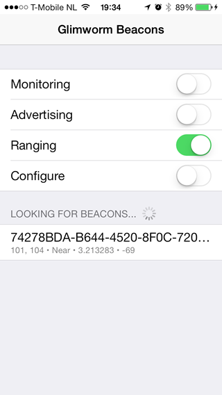
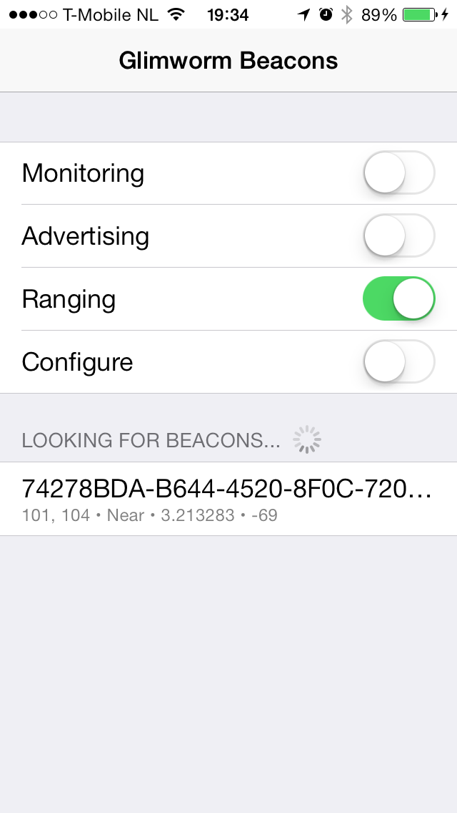
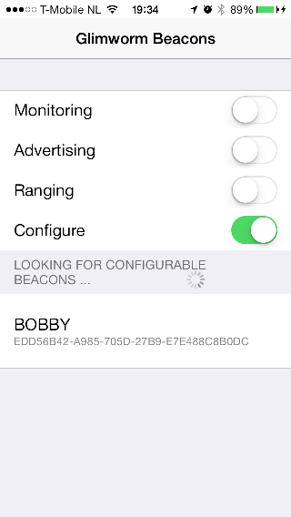
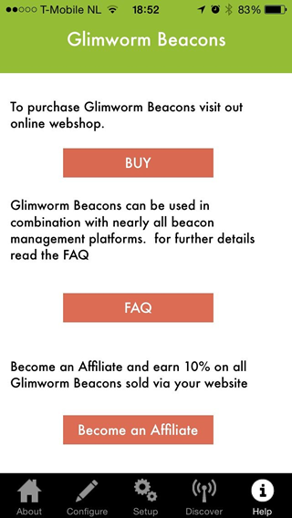
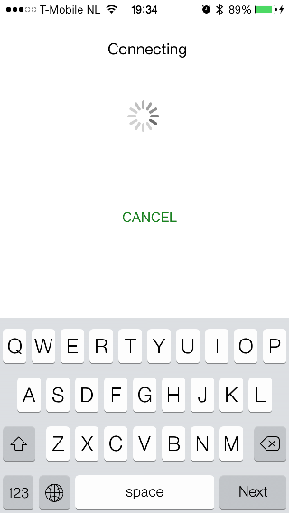
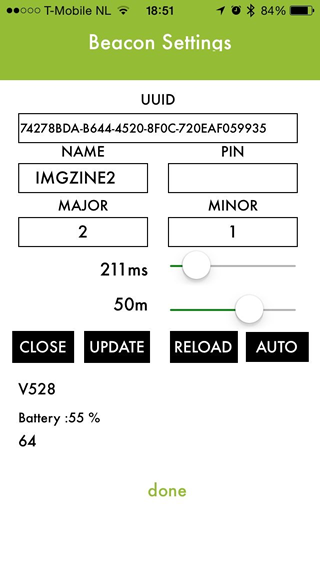
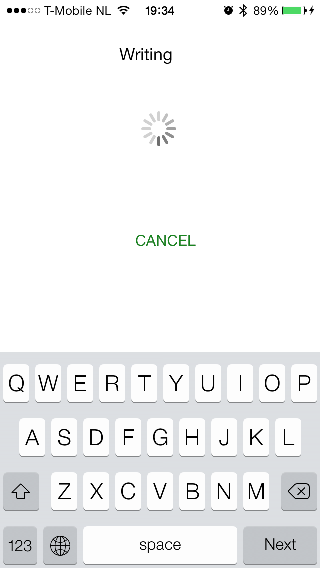

Glimworm iBeacon configuraton app
=================================
**A demo app for the iBeacons API in iOS 7 and a configuration tool for Glimworm iBeacons**

##Thanks to Nick Toumpelis
Firstly we want to give great thanks to Nick Toumpelis who developed HiBeacons (http://github.com/nicktoumpelis) and shared it in GitHub.  The core of this app is HiBeacons.  We have then developed onto it a configuration function for Glimworm iBeacons.

This App is a fully functional demo app for the new iBeacons API in iOS 7. The app can be used to demonstrate beacon monitoring, advertising and ranging, by toggling on/off three switches. You can easily see any beacons in the vicinity, with all their info, under the 'Detected Beacons' section.

There is a configuration button which will look for Glimworm iBeacons and allow you to set the UUID, Major, Minor Ad ratio and Range via a serial BLE connection

## Screenshot

## Notes
###From HiBeacons
- Monitoring works when the app is in the background. You will get a local notification when entering a beacon region.
- The app can only monitor and range a single beacon region, but can easily be extended for multiple.
- You can find and set the UUID and identifier for the beacon (and the region) at the top of NTViewController.m. 
- Major and minor integers are generated randomly every time a new advertising session starts. 
- The app will not list itself as a beacon, even if you toggle advertising on. (It's how the API works.) You need to run another instance of the app for that.
- The UI doesn't show any alerts; check the console for more details.

###From Glimworm Beacon Configuration
- Configuration may ask for a pairing passcord which is 6 digits

### Background advertising

Beacon region advertising doesn't work in the background in iOS 7, even with the `bluetooth-peripheral` mode set in `Info.plist`.

## Contact

[Jonathan Carter](http://github.com/jonathanrcarter) ([@jonathanrcarter](https://twitter.com/jonathanrcarter))
[Nick Toumpelis](http://github.com/nicktoumpelis) ([@nicktoumpelis](https://twitter.com/nicktoumpelis))

## Licence

Glimworm Beacon Manager for iPhone is available under the MIT licence. See the LICENCE file for more info.
